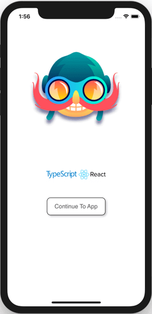
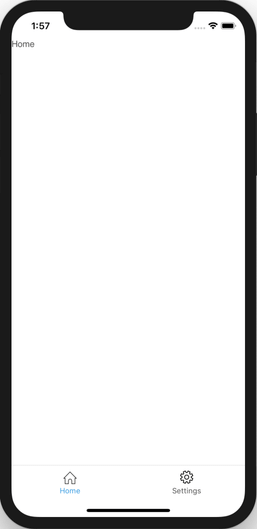

# React Native Typescript Boilerplate

  [](./CONTRIBUTING.md)

### An opinionated [React Native](https://facebook.github.io/react-native/docs/getting-started) Starter Kit with [React Native Navigation](https://github.com/wix/react-native-navigation) + [Redux](https://github.com/reactjs/redux) + [TSLint](https://github.com/airbnb/javascript) to build iOS / Android apps using [TypeScript](https://github.com/Microsoft/TypeScript-React-Native-Starter)

The project has been setup based off [RN Getting Started](https://facebook.github.io/react-native/docs/getting-started) and instructions from [Microsoft's Github TypeScript React Native Starter](https://github.com/Microsoft/TypeScript-React-Native-Starter) repo.

This repo supports the latest version of React Native (v0.57.8+) supported by RNN (at the time of writing).

**UPDATE** (8th March '19): RNN upgraded to v2.13.1 | RN to 0.58.6 | React to 16.8.4

**UPDATE** (30th April '19): RNN upgraded to v2.18.3 | RN to 0.59.5 | React to 16.8.6

**UPDATE** (2nd April '19): RNN upgraded to v2.26.2 | RN to 0.59.10

### Who is this for?

Someone looking to jumpstart building apps using RN and prefers TS. The base setup has been taken care of, just `yarn install` and get going from respective IDEs.

You might also want to [rename](https://medium.com/the-react-native-log/how-to-rename-a-react-native-app-dafd92161c35) the app for your own use.

> _Disclaimer_: This is an **opinionated** approach to building apps with RN. The project structure is inspired by multiple production apps built by the contributors.

The project uses and encourages to use industry best practices / tools / libraries like RNN, redux, tslint, separation of concern and structure to build a maintainable app.

|  |  |
| :-------------------------------------------------------: | :---------------------------------------------------: |


### Table of Contents

- [Project Structure](#project-structure)
- [Running](#running)
- [Lint](#lint)
- [Unit Tests](#unit-tests)
- [Cheat Sheet](#cheat-sheet)
  - [React Native Navigation](#react-native-navigation)
  - [Styles](#styles)
  - [Widgets / Elements](#widgets---elements)
- [Contributing](#contributing)
- [TODO](#todo)

#### Project Structure

```
/
├── android					Android Native code
├── ios						iOS Native Code
├── shared
│   ├── redux					Business Logic
│   │	    ├── constants
│   │	    ├── actions
│   │	    ├── api
│   │	    ├── reducers
│   │	    ├── store
│   │	    └── thunk
│   └── utilities
├── src
│   ├── config					App Configuration
│   ├── constants				Screens, Localization
│   ├── navigators				Router, Navigation
│   ├── view					UI compoments - Screens, Widgets
│   │	    ├── elements			Custom elements
│   │	    ├── assets
│   │	    ├── screens
│   │	    ├── styles				Typography
│   │	    └── widgets				Custom components
│   └── utilities
├── __tests__					Unit Tests
│   ├── presentation
│   └── redux
├── .babelrc
├── .gitignore
├── .travis.yml					Travis CI
├── tsconfig.json				TypeScript Configuration
├── tslint.js					TSLint configuration - extending AirBnb
├── tsconfig.json
├── app.json
├── index.js					Application Entry point
├── package.json
└── README.md
```

`shared`
Everything related to application business logic (store) resides under this directory.

`src`
Only presentation layer for the app, styles, images, icons are meant to be under this.

`web`
Going forward, plan is to add a web folder to the project, that can leverage the business logic from shared folder.

#### Running

Make sure node version installed is `>=8.11.x <=9`

```
yarn install
```

#### Launch

###### iOS

Launch application from XCode

###### Android

For android, run the Metro Bundler from the terminal

```
npm run start
```

and then launch from IDE.

#### Lint

To run tslint on the application:

```
yarn lint
```

To fix most tslint issues automatically

```
yarn lint:fix
```

#### Unit Test

Unit tests are under `__test__` directory at root.

To run unit test on the application:

```
npm run test
```

To find unit test coverage for the application:

```
npm run test:coverage
```

#### Cheat Sheet

##### React Native Navigation

The application launches with a blank splash screen, and then moves to a tabbed based home view. Developers can feel free to add application launch logic to this, like fetch user token, load persist state etc., or skip the splash if not required, or change this setup altogether.

##### Styles

The `styles` folder contains `global` style and `typography` for the application. Styles for each screen has been placed with the screen, as they are going to be used together with the screen, unlike web.

##### Widgets / Elements

The custom components have been broken into 2 major categories, namely - **widgets**, **elements**

A Good use case would be:

- widgets: carousels component, banner component, any component providing a complete functionality
- elements: A custom, may be `<CText>` or `<ButtonDefault>`, element that has default font properties like font, size and overrides the native elements.

#### Contributing

Please check out [Contributing](https://github.com/AmitM30/react-native-typescript-boilerplate/blob/master/CONTRIBUTING.md).

#### Authors

- [**Anurag Chutani**](https://github.com/a7urag) - _Android Setup_
- [**Brian Varley**](https://github.com/BrianJVarley) - _Windows Setup_

See also the list of [contributors](https://github.com/AmitM30/react-native-typescript-boilerplate/contributors) who participated in this project.

#### TODO

- [ ] Build React web app using `shared` business logic
